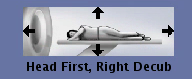

## About

dcm_qa_decubitus is a simple DICOM to NIfTI validator script and dataset. Specifically, it is designed to evaluate atypical [patient positions](https://dicom.innolitics.com/ciods/ct-image/general-series/00185100). In general, most neuroimaging is acquired `HFS` (head first supine). While most MRI scanners do not allow feet-first MRI of the brain, it is possible to acquire Head First-Prone (HFP), Head First-Supine (HFS), Head First-Decubitus Right (HFDR), and Head First-Decubitus Left (HFDL) images. For example, the GE scanner console illustrates the participant postion for HFDR.

A T1 and diffusion weighted scan is provided in each of the positions. The scans are of intentionally low resolution to create a small dataset. It is unfortunate the the diffusion scans were anisotropic.

## Running

Assuming that the executable dcm2niix is in your path, you should be able to simply run the script `batch.sh` from the terminal.